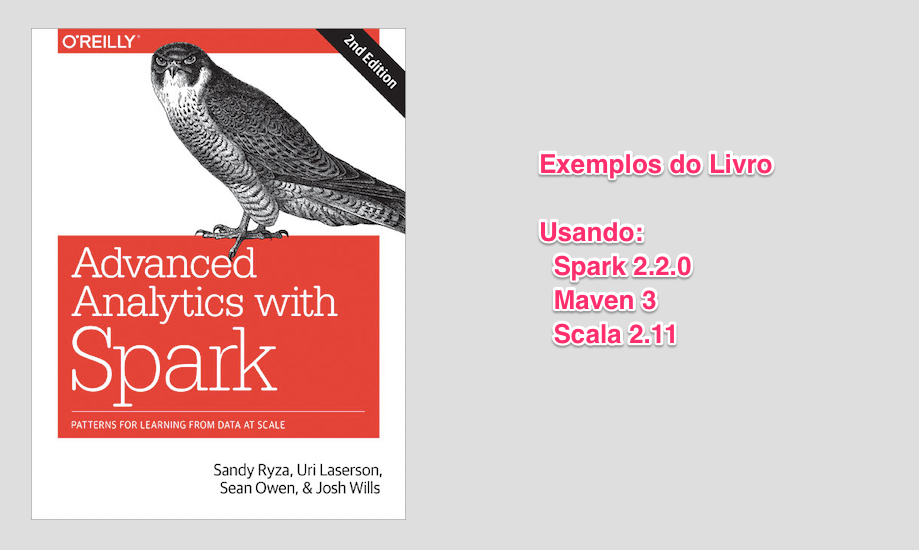

Advanced Analytics with Spark Source Code
=========================================



## Clonando o repositório

```bash
git clone git@github.com:joao-parana/aa-spark.git
```

## Fazendo o build

### Apenas o POM usado pelos projetos filhos

```bash
cd aa-spark
mvn -Drat.ignoreErrors=true \
    -Dcheckstyle.skip \
    -Dmaven.test.skip=true \
    -N clean install
```

### Fazendo o build de todos os projetos

Isso pode demorar dezenas de minutos

```bash
mvn -Drat.ignoreErrors=true \
    -Dcheckstyle.skip \
    -Dmaven.test.skip=true \
    clean package
```

### Fazendo o build de um projeto específico

Exemplo de build do capitulo 4 - Arvores de Decisão.

```bash
cd ch04-rdf 
mvn -Drat.ignoreErrors=true \
    -Dcheckstyle.skip \
    -Dmaven.test.skip=true \
    clean package
```

### Executando um projeto específico

Executando o exemplo do capitulo 4 - Arvores de Decisão.

```bash
java -jar target/ch04-rdf-2.2.0-jar-with-dependencies.jar 4
```

Se não desejar ver a barra de progresso do Spark redirecione o `stderr` para `/dev/null`

```bash
java -jar target/ch04-rdf-2.2.0-jar-with-dependencies.jar 4  2> /dev/null 
```


Podemos alterar o arquivo JAR gerado para trocar o nivel de log do Spark de INFO para WARN

```bash
jar -xvf target/ch04-rdf-2.2.0-jar-with-dependencies.jar org/apache/spark/log4j-defaults.properties 
vi org/apache/spark/log4j-defaults.properties 
jar -uvf target/ch04-rdf-2.2.0-jar-with-dependencies.jar org/apache/spark/log4j-defaults.properties
```

## Playground com Scala

Temos várias opções para usar o **Spark** no modo exploratório.

* spark-shell
* SBT REPL
* Scala REPL
* Ammonite REPL
* Notebook Jupyter

A opção spark-shell é a padrão e é fornecida pelos desenvolvedores do Spark.
SBT REPL e Scala REPL é apropriado para quem já tem experiência com Scala.
Notebook Jupyter é destinado aos problemas de documentar toda uma solução
de análise exploratória e pode ser usada via Docker clonando este repositório:
`git clone git@github.com:joao-parana/notebook.git`

A minha opção preferida é o Ammonite REPL que descrevo aqui

### Scala, Spark e Ammonite
Spark está na versão 2.2.0.
É necessário instalar a versão scala-2.11.12  do Scala pois é pré-requisito.

O Ammonite é uma shell REPL para Scala com funcionalidades incríveis. 

Para instalar basta executar:

```bash
sudo curl -L -o /usr/local/bin/amm https://git.io/vdNvV && sudo chmod +x /usr/local/bin/amm && amm
```

`amm` é o nome do executável que fica em `/usr/local/bin` após a instalação

Você nem precisa ter no seu computador uma certa API ou Framework. Ele mesmo instala de dentro da shell. Veja o exemplo abaixo onde ele baixa via **Apache IVY** o `sttp` que é uma biblioteca com cliente HTTP para Scala e já faz um GET no endereço [http://httpbin.org/ip](http://httpbin.org/ip) 

Este é só um exemplo simples.

```bash
import $ivy.`com.softwaremill.sttp::core:1.0.5`
import com.softwaremill.sttp._
implicit val backend = HttpURLConnectionBackend()
sttp.get(uri"http://httpbin.org/ip").send()
```

Você vai ficar impressionado com as funcionalidades deste REPL.
Veja detalhes em http://ammonite.io/#Ammonite-REPL 

Com ele podemos fazer tudo no terminal (sem Interface gráfica).

Usando o Spark dentro do Ammonite

```scala
import $ivy.{
          `org.apache.spark::spark-core:2.2.0`,
          `org.apache.spark::spark-sql:2.2.0`,
          `org.apache.spark::spark-yarn:2.2.0`
  }
import org.apache.spark.{SparkContext, SparkConf}
import org.apache.spark.sql.SQLContext
import org.apache.spark.sql.SparkSession

val conf = new SparkConf().setMaster("local[*]").setAppName("ogasawara")
val sc = new SparkContext(conf)
val sqlContext = new SQLContext(sc)
var i = 0
// suponha o arquivo MyScript.sc com este conteúdo acima.
// então você poderá carregar para a memória com:
import $file.MyScript, MyScript._

// Depois você poderá rodar isso:
val df = sqlContext.read.json("/tmp/iron-icons-bower.json") // um arquivo JSON qualquer
df.foreachPartition{records =>
    records.foreach{
      record => i += 1; println("i = " + i); println(record)
    }
  }
```

Esta shell é melhor que spark-shell no sentido que podemos importar pacotes interativamente e editar em multi-linha

Segue abaixo o README original do projeto dos autores do livro.

## README original

Code to accompany [Advanced Analytics with Spark](http://shop.oreilly.com/product/0636920035091.do), by 
[Sandy Ryza](https://github.com/sryza), [Uri Laserson](https://github.com/laserson), 
[Sean Owen](https://github.com/srowen), and [Josh Wills](https://github.com/jwills).

[Para comprar veja esse link](http://shop.oreilly.com/product/0636920056591.do)

### 2nd Edition (current)

The source to accompany the 2nd edition is found in this, the default 
[`master` branch](https://github.com/sryza/aas).

### 1st Edition

The source to accompany the 1st edition may be found in the 
[`1st-edition` branch](https://github.com/sryza/aas/tree/1st-edition).

### Build

[Apache Maven](http://maven.apache.org/) 3.2.5+ and Java 8+ are required to build. From the root level of the project, 
run `mvn package` to compile artifacts into `target/` subdirectories beneath each chapter's directory.

### Data Sets

- Chapter 2: https://archive.ics.uci.edu/ml/machine-learning-databases/00210/
- Chapter 3: http://www-etud.iro.umontreal.ca/~bergstrj/audioscrobbler_data.html
- Chapter 4: https://archive.ics.uci.edu/ml/machine-learning-databases/covtype/
- Chapter 5: https://kdd.ics.uci.edu/databases/kddcup99/kddcup99.html (do _not_ use http://www.sigkdd.org/kdd-cup-1999-computer-network-intrusion-detection as the copy has a corrupted line)
- Chapter 6: https://dumps.wikimedia.org/enwiki/latest/enwiki-latest-pages-articles-multistream.xml.bz2
- Chapter 7: ftp://ftp.nlm.nih.gov/nlmdata/sample/medline/ (`*.gz`)
- Chapter 8: http://www.andresmh.com/nyctaxitrips/
- Chapter 9: (see `ch09-risk/data/download-all-symbols.sh` script)
- Chapter 10: ftp://ftp.ncbi.nih.gov/1000genomes/ftp/phase3/data/HG00103/alignment/HG00103.mapped.ILLUMINA.bwa.GBR.low_coverage.20120522.bam
- Chapter 11: https://github.com/thunder-project/thunder/tree/v0.4.1/python/thunder/utils/data/fish/tif-stack
